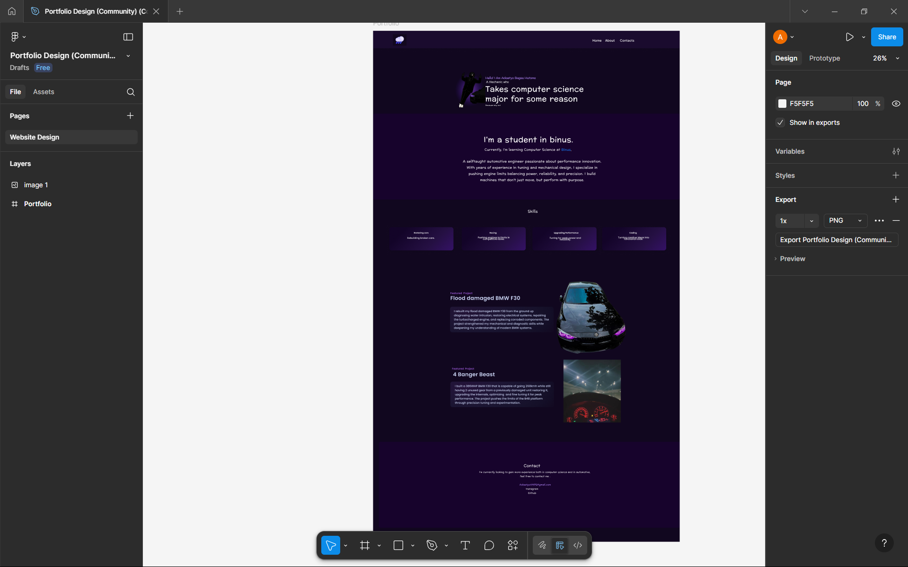
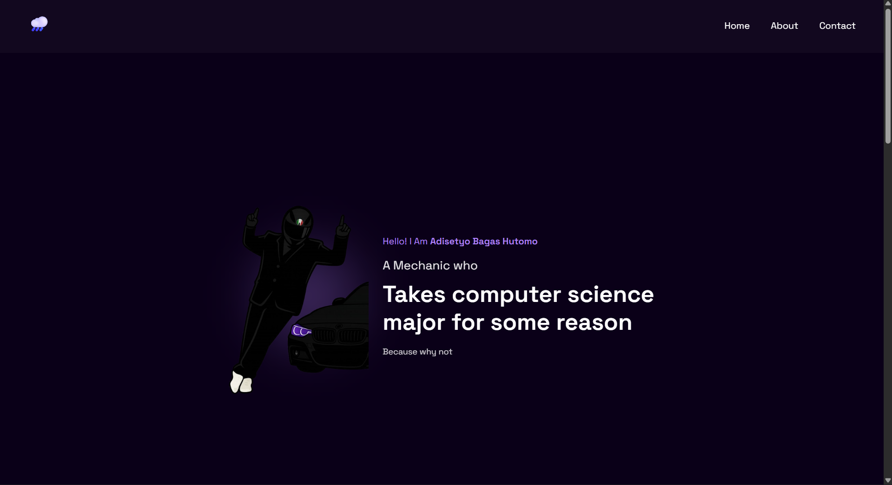

# 🌐 Personal Portfolio Website

## 📖 Project Overview
This is a single-page responsive portfolio website created as part of the **Human-Computer Interaction (HCI) Lab Assignment**.  
The website showcases my personal profile, projects, skills, and contact information. It is fully built using **HTML5** and **CSS3**.

---

## 🔗 Links
- **🌍 Portfolio Website:** [Click Here](https://moondayrain.github.io/Portfolio/)  
- **🎨 Figma Design:** [Click Here](https://www.figma.com/design/9Htq8z3a4rcSvhrwlsQ8hQ/Portfolio-Design--Community---Copy-?node-id=0-1&t=fAxUMqUfQdynNlOZ-1)

---

## 🎯 Purpose
The main goal of this project is to:
- Practice **responsive web design** techniques.
- Learn proper **HTML structure and CSS styling**.
- Showcase personal and sample projects in a professional layout.
- Demonstrate creativity and technical understanding of front-end design.

---

## 👥 Target Audience
This portfolio is designed for:
- ✅ Academic purposes  
- ✅ Potential mutual hobbyist
- ✅ Project opportunities

---

## 🧱 Technologies Used
- **HTML5**
- **CSS3 (Flexbox, Grid, Box Model, Media Queries)**
- **Google Fonts – Space Grotesk**
- **Figma** (for UI design and layout planning)

---

## 📐 Layout & Sections
The website includes the following sections:

| Section | Description |
|----------|--------------|
| **Header** | Navigation bar with logo and links to Home, About, and Contact |
| **Hero / Home** | Introduction and tagline |
| **About Me** | Short bio and link to Binus University |
| **Skills** | Cards showing automotive and coding abilities |
| **Projects** | Two featured builds (BMW F30 restoration and tuning project) |
| **Contact** | Email and social media links |
| **Footer** | Copyright and ownership info |

---

## 📱 Responsiveness
The layout automatically adapts to:
- 🖥️ **Desktop**
- 💻 **Tablet**
- 📱 **Mobile**

Responsiveness is achieved using **CSS media queries**, **relative units (%, vh, vw, em)**, and flexible **Flexbox/Grid** layouts.

---

## 📂 Folder Structure
```bash
portfolio-website/
│
├── index.html
├── style.css
├── Images/
│   ├── mechanic.png
│   ├── bmw.png
│   └── dashboard.jpg
└── README.md
```

---

## 📄 Notes

- I used ChatGPT to help me restructure the HTML and CSS so it is more aesthetically pleasing.
- The color of the website is inspired by my fav color palette in a car which is black with purple accent

## 📸 Screenshots

### Figma


### Website


---

